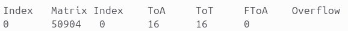
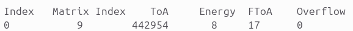

# Data Analysis Software for the THOR-SR Mission

This repository compiles all the necessary files to both convert to the required format and analyze the data gathered by the MiniPIX TPX3 CdTe detectors. It contains the MEGAlib geometry files for a single "finger", the quad detector and the whole THOR instrument, as well as the C++ program that performs the conversion from the *.t3pa* to the *.evta* format. 


## Requirements

- C++ Compiler
    - [GCC](https://gcc.gnu.org/) (Linux)
    - [MinGW](https://www.mingw-w64.org/) (Windows)
- [MEGAlib](https://megalibtoolkit.com/home.html) - Required in order to analyze the converted data.


## Configuration file

The *config.txt* should contain the information regarding the reconstruction you want to run. It can have 3 separate structures, according to which geometry you are using (Finger, Quad, or the whole instrument).

All the values shall be separated by a single whitespace and are in centimeters unless specified otherwise. They should also be in the exact order presented, or else the program won't work.

### Finger

```
mode finger 
bottomLeftCorner 0.0 0.0
height 0.0
sizePixel 0.0055
detectorSize 1.408 1.408
energy kev
dataFile data_files/Ba133_colimated1cm-calibrated.t3pa
abct ABCT_Files/finger
```

* **mode finger** - Denotes that the program is expecting arguments for a finger.
* **bottomLeftCorner 0.0 0.0** - The bottom left corner of the detector is in placed in the coordinates (0.0, 0.0) of the xy plane.
* **height 0.0** - The detector is at the coordinate 0.0 on the z axis.
* **sizePixel 0.0055** - The size of a single pixel is 0.0055 centimeters.
* **detectorSize 1.408 1.408** - The detector's measurements are 1.408 by 1.408 centimeters.
* **energy kev**  - The input file's energy value is in KeV. If the values are in ToT, "kev" shall be replaced by "tot" in order for the values to be converted.
* **dataFile data_files/Ba133_colimated1cm-calibrated.t3pa** - The input file's path.
* **abct ABCT_Files/finger** - Path to the detector's ABCT files folder. The files should be named "Files_a.txt", "Files_b.txt", "Files_c.txt" and "Files_t.txt" for each corresponding variable.

### Quad

```
mode quad
bottomLeftCorner 0.0 0.0
height 0.0
spaceBetween 0.1 0.5 0.1
sizePixel 0.0055
detectorSize 1.408 1.408
energy kev
dataFile data_files/quad_test
abct ABCT_Files/quad_test
```

Differences from the previous configuration:
* **mode quad** - The mode is now select as "quad".
* **spaceBetween 0.1 0.5 0.1** - This line indicates that the space between the first and second finger is 0.1cm, between the second and third finger is 0.5cm and between the third and fourth finger is 0.1cm.
* **abct ABCT_Files/quad_test** - Each detector's ABCT files must be in a separate folder, numbered from 0 to 3, 0 being the leftmost finger, and 3 the farthest one on the right.

### Instrument

```
mode instrument
bottomLeftCorner0 0.0 1.546
bottomLeftCorner1 0.0 1.546
bottomLeftCorner2 0.0 1.546
bottomLeftCorner3 0.0 1.546
height 0.0 0.38 2.38 2.76
rotated 1 0 1 0
inverted 1 0 1 0
spaceBetween 0.1 0.5 0.1
sizePixel 0.0055
detectorSize 1.408 1.408
energy kev
dataFile data_files/instrument_test
abct ABCT_Files/quad_test
```

* **mode instrument** - The mode is now selected as "instrument".
* **bottomLeftCorner0 0.0 1.546** - Each quad now has its own separate coordinates, identified from 0 to 3, from the uppermost to the lowest one.
* **height 0.0 0.38 2.38 2.76** - The height of each quad, in centimetres, from the lowest to the highest.
* **rotated 1 0 1 0** - Represents if each quad is rotated 180 degrees around the z axis. 1 for rotated quads, 0 for not rotated.
* **inverted 1 0 1 0** - Represents if each quad is rotated 180 around the x axis. 1 for inverted quads, 0 for not rotated.
* **dataFile data_files/instrument_test** - The input files are located in this folder. They must be ordered alphabetically, the uppermost quad being the first, while the fourth is the last in this order.
* **abct ABCT_Files/quad_test** - Each quad's folders are placed in the respective folders numbered from 0 to 3, from the uppermost quad to the lowest. Then, inside each quad's folder, each finger detector's ABCT files must also be in a separate folder, numbered from 0 to 3, 0 being the leftmost finger, and 3 the farthest one on the right.


### Note regarding the energy conversion

if your *.t3pa* file's first line looks like this:



Instead of like this:



It means that your file's Energy hasn't been converted yet (Fourth column, from *ToT* to *Energy*). To do this, type the proper option in the configuration file.

If the energy is in ToT:
```
energy tot
```

If it is in KeV:
```
energy kev
```

This change will make sure the energy conversion is done when necessary and that the correct value is used.

## How to run

Navigate to the *data-analysis-thor* directory:

```
cd data-analysis-thor
```

Compile and run the code. It will generate a *.evta* file in accordance to whichever configurations you provided in the *config.txt* file.

On Windows:
```
g++ -o output .\main.cpp
.\output.exe
```

On Linux:
```
cc main.cpp -o output -std=c++17 -lstdc++ -lm
./output
```

A file titled *dados.evta* will then be created, which can be loaded onto *Revan* using the following commands: 

For data collected by a single finger:
```
revan -g finger_THOR/THOR_finger.geo.setup -f dados.evta -c finger_THOR/THOR.cfg
```

Quad:
```
revan -g quad_THOR/THOR_finger.geo.setup -f dados.evta -c quad_THOR/THOR.cfg
```

Instrument:
```
revan -g instrument_THOR/THOR.geo.setup -f dados.evta -c instrument_THOR/THOR.cfg
```

<!-- 
### Finger

Navigate to the *finger_THOR* directory: 
```
cd finger_THOR
```

Then compile and run the C++ code. On Windows:
```
g++ -o output .\data_analysis_finger.cpp
.\output.exe
```

On Linux:
```
cc data_analysis_finger.cpp -o output -std=c++17 -lstdc++ -lm
./output
```

A file named *dados.evta* will be created, which can then be loaded onto *Revan* using:
```
revan -g THOR_finger.geo.setup -f dados.evta -c THOR.cfg
```


### Quad
Navigate to the *quad_THOR* directory:
```
cd quad_THOR
```

Compile and run the C++ code. On Windows:
```
g++ -o output .\data_analysis_quad.cpp
.\output.exe
```

On Linux:
```
cc data_analysis_quad.cpp -o output -std=c++17 -lstdc++ -lm
./output
```

This will create a file named *dados.evta*, which can be loaded onto *Revan* using the same command as before:
```
revan -g THOR_finger.geo.setup -f dados.evta -c THOR.cfg
```


### Complete THOR Instrument
Go to the instrument directory:
```
cd instrument_THOR
```
Compile and run the C++ code. On Windows:
```
g++ -o output .\data_analysis_instrument.cpp
.\output.exe
```

On Linux:
```
cc data_analysis_instrument.cpp -o output -std=c++17 -lstdc++ -lm
./output
```

This will create a file named *dados.evta*, which can be loaded onto *Revan* using the same command as before:
```
revan -g THOR.geo.setup -f dados.evta -c THOR.cfg
```


### Energy conversion from ToT to KeV
if your *.t3pa* file's first line looks like this:


Instead of like this:


It means that your file's Energy hasn't been converted yet (Fourth column, from *ToT* to *Energy*). To do this, when you run the program using the flag *-c*:
```
.\output.exe -c 
```
or

```
./output -c
```

Whether you're on Windows or Linux. This flag will make sure the energy conversion is done and that the correct value is used. -->